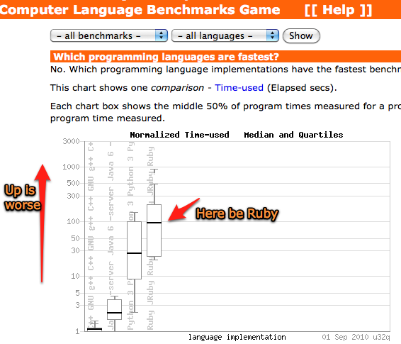

!SLIDE smbullets smsmbullets
# C Extension Support For JRuby

* Tim Felgentreff
* Finn GmbH
* [blog.bithug.org](http://blog.bithug.org/), [github/timfel](http://github.com/timfel), [@timfelgentreff](http://twitter.com/timfelgentreff)    

!SLIDE center
# Ruby is about abstracting away

!SLIDE center
# Ruby is slow
#### (when benchmarking classic CS problems)

!SLIDE center
# Ruby _can_ do heavy lifting

